You can install and register an install in two different ways:

1. [Customer deployment email](#customer-deployment-email) - You send a deployment email from the webadmin directly to your end-customer. Your customer follows the instructions contained in the email to install and register.
2. [Dealer on-site](#dealer-installs-dca-while-on-site) - While on-site, you can download and register a new install directly from the webadmin.

## Dealer Sends Customer Deployment Email
For Print Tracker to collect data from printers and copiers it is necessary to install data collection agent (DCA) software on a computer that has network access to the printing devices. The following step-by-step describes the process for dealers to send customers an e-mail that includes a link to the DCA setup file, a DataLink code, and instructions to install and register a DCA. DCAs should be registered with the data link code of the appropriate customer entity.

### Create/Select Entity
1. Select customer entity
    1. From browser log-on to the [webadmin](https://www.app.printtrackerpro.com/auth/login).
    2. Click on the list box drop-down arrow next to your dealer entity name. 
    3. Search to see if your customer has an entity record by entering the customer’s name in the ‘Search Entities’ text box.
    4. Press the **Search** button (an alternative is to scroll through the entity list). 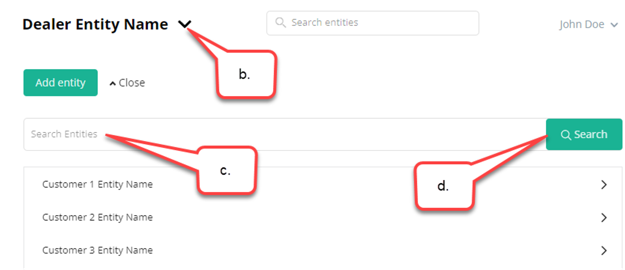
    5. If the customer entity is already in the list, then:
        1. Select the customer entity. 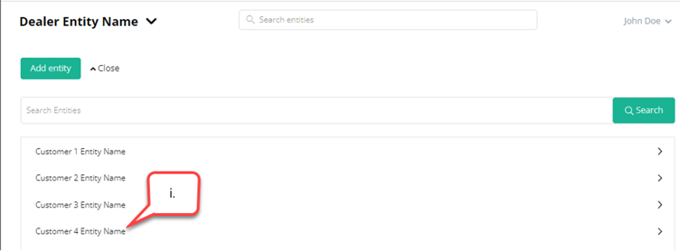
        2. Close the search screen. 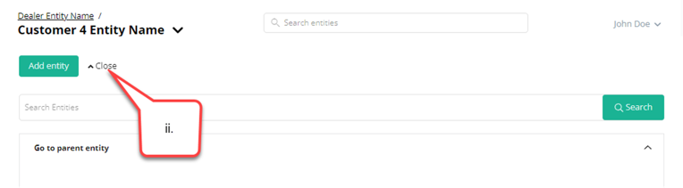
        3. Continue to step 2.
    6. If the customer does not yet have an entity, then create one:
        1. Click on the **Add entity** button. 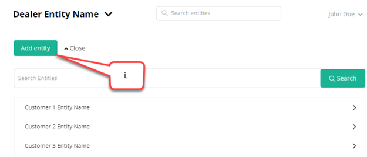
        2. From the **Add entity** screen enter the preferred customer account name in the Entity name text box and optionally enter notes and address information.
        3. Click on the **Save and edit settings** button at the bottom of the **Add entity** screen. 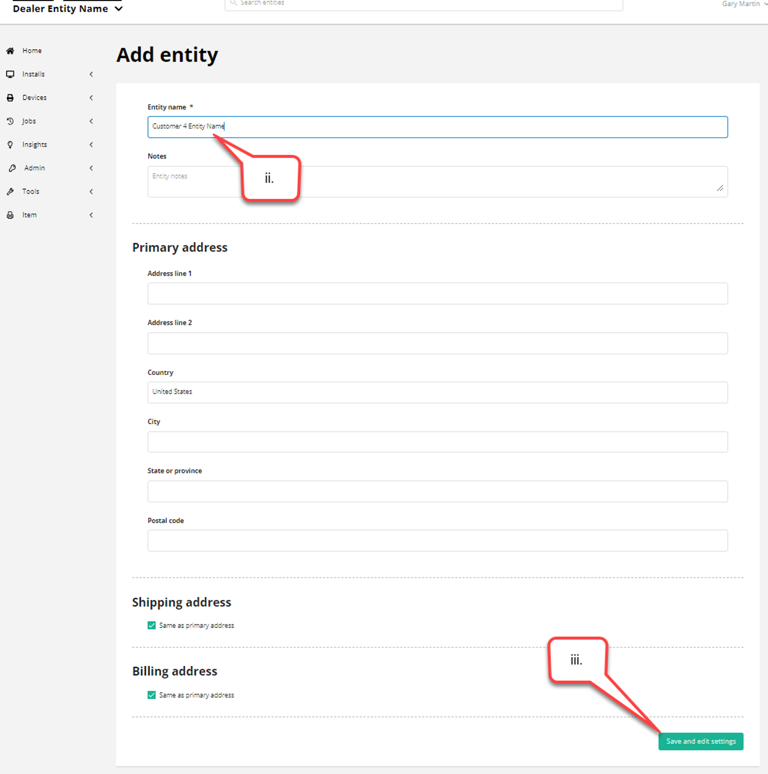
2. Verify entity settings are correct.
    1. From the **customer’s entity > Admin > Manage Entity** screen select the **Settings** tab.
    2. Review [settings](../webadmin/settings/overview.md) and if necessary, apply changes.
    3. Click on the **Save and deploy new DCA** link at the bottom of the **Manage Entity** screen. 

### Sending The Deployment Email
1. From the **Installs > Deploy new install** screen click on **Send installation email**.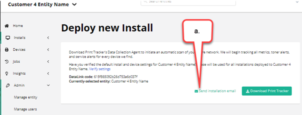
2. Enter an e-mail address.
3. Optionally select **Add CC to e-mail** and enter an additional e-mail address.
4. Click on the **Send email** button.

### Customer Installs DCA Using Deployment Email
1. Open deployment email and either:
    1. Click on the **Download Now** button.
    2. Click on the [setup file download link](https://www.cdn.printtrackerpro.com/modules/installer/PrintTrackerProSetup.msi).
2. Run the setup file once the installer download completes.
    1. Using **File Explorer** open your Downloads folder. 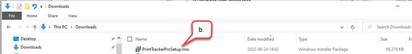
    2. Double-click on the file **PrintTrackerProSetup.msi**. 
3. Complete the installation wizard.
    1. When the Print Tracker Pro Setup Wizard window appears click on the **Next** button. 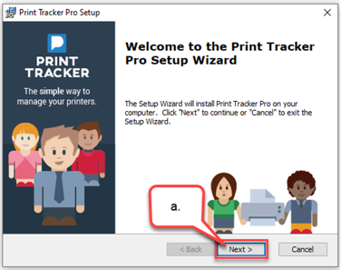
    2. When the Configure Shortcuts screen appears click on the **Next** button. 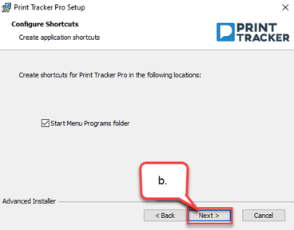
    3. When the ‘End User License Agreement screen appears: 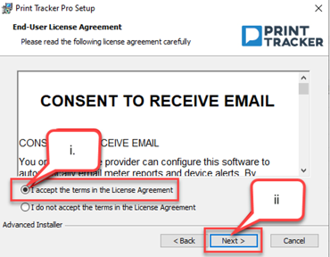
        1. Review terms and select the **I accept terms in the License Agreement**.
        2. Click on the **Next** button.
    4. When the Select Installation Folder screen appears we recommend using the default folder `C:\Program Files (x86)\Print Tracker Pro\`.  Click on the **Next** button. 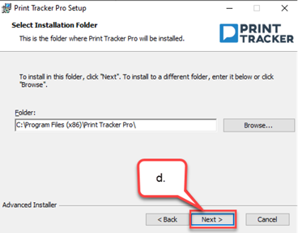
    5. When the Ready to Install screen appears click on the **Install** button. 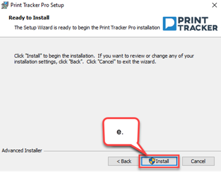.
    6. If a Windows User Account Control appears click on the **Yes** button to allow the installation process to continue. 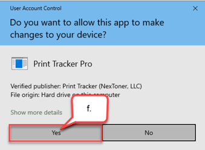
    7. When the ‘Completing the Print Tracker Pro Wizard’ screen appears click on the **Finish** button. 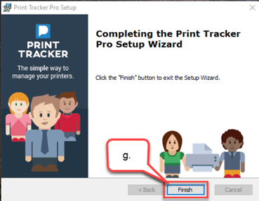
4. Activate the data collection agent (DCA).
    1. When the browser activation screen appears **Devices Connected by Networked** is selected by default.  If you only want to monitor a USB connected device then click on **Local (USB)**. 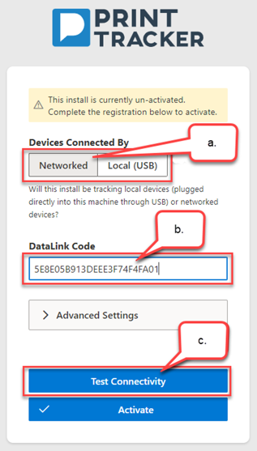
    2. Review the ‘Connectivity Results’ screen to verify all 3 connections passed, then close the screen. 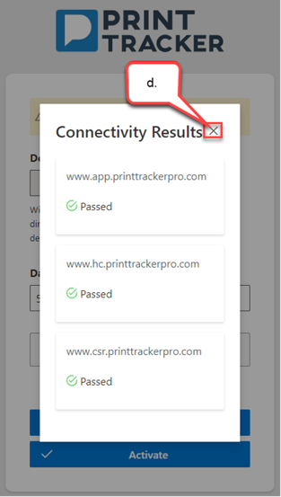
    3. Click the **Activate** button. 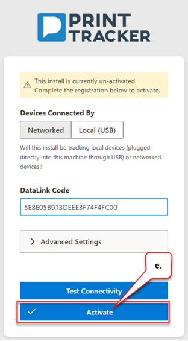
    4. Once message ‘The install is registered’ appears close the browser window.  The setup is complete. 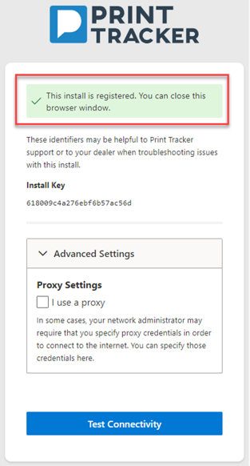

## Dealer Installs DCA While On-site
For Print Tracker to collect data from printers and copiers it is necessary to install data collection agent (DCA) software on a computer that has network access to the printing devices. The following step-by-step describes how a dealer can install and register a Print Tracker Pro DCA while logged on to the customer’s host computer. Installs / DCAs should be registered with the datalink code of the appropriate customer  entity.

### Create Select Entity
1. Select customer entity
    1. From browser log-on to the [webadmin](https://www.app.printtrackerpro.com/auth/login).
    2. Click on the list box drop-down arrow next to your dealer entity name.
    3. Search to see if your customer has an entity record by entering the customer’s name in the ‘Search Entities’ text box.
    4. Press the **Search** button (an alternative is to scroll through the entity list). 
    5. If the customer entity is already in the list, then:
        1. Select the customer entity. 
        2. Close the search screen. 
        3. Continue to step 2.
    6. If the customer does not yet have an entity, then create one:
        1. Click on the **Add entity** button. 
        2. From the **Add entity** screen enter the preferred customer account name in the Entity name text box and optionally enter notes and address information.
        3. Click on the **Save and edit settings** button at the bottom of the **Add entity** screen. 
2. Verify entity settings are correct.
    1. From the **customer’s entity > Admin > Manage Entity** screen select the **Settings** tab.
    2. Review [settings](../webadmin/settings/overview.md) and if necessary, apply changes.
    3. Click on the **Save and deploy new DCA** link at the bottom of the **Manage Entity** screen. 
3. Download the setup file:
    1. From the **Installs > Deploy new install** screen click on the **Download Print Tracker** button. 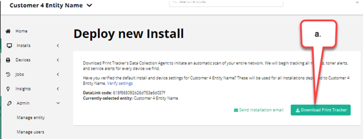
4. Run the setup file once the installer download completes.
    2. Using **File Explorer** open your Downloads folder. 
    3. Double-click on the file **PrintTrackerProSetup.msi**.
5. Complete the installation wizard.
    4. When the Print Tracker Pro Setup Wizard window appears click on the **Next** button. 
    5. When the Configure Shortcuts screen appears click on the **Next** button. 
    6. When the ‘End User License Agreement screen appears: 
        1. Review terms and select the **I accept terms in the License Agreement**.
        2. Click on the **Next** button.
    7. When the Select Installation Folder screen appears we recommend using the default folder `C:\Program Files (x86)\Print Tracker Pro\`.  Click on the **Next** button. 
    8. When the Ready to Install screen appears click on the **Install** button. .
    9. If a Windows User Account Control appears click on the **Yes** button to allow the installation process to continue. 
    10. When the ‘Completing the Print Tracker Pro Wizard’ screen appears click on the **Finish** button. 
6. Activate the data collection agent (DCA).
    1. When the browser activation screen appears **Devices Connected by Networked** is selected by default.  If you only want to monitor a USB connected device then click on **Local (USB)**. 
    2. Review the ‘Connectivity Results’ screen to verify all 3 connections passed, then close the screen. 
    3. Click the **Activate** button. 
    4. Once message ‘The install is registered’ appears close the browser window.  The setup is complete. 
7. Verify that the install was registered by navigating to the **Installs > View installs** screen. 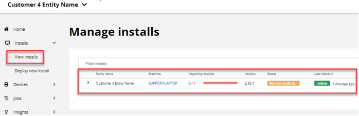
8. (Optional) If time permits, once the DCA has completed initialization check to see if the DCA has discovered those devices that should be monitored. If necessary add devices as described at [discovering devices](../webadmin/fleet-management/devices.md#discovering-devices).