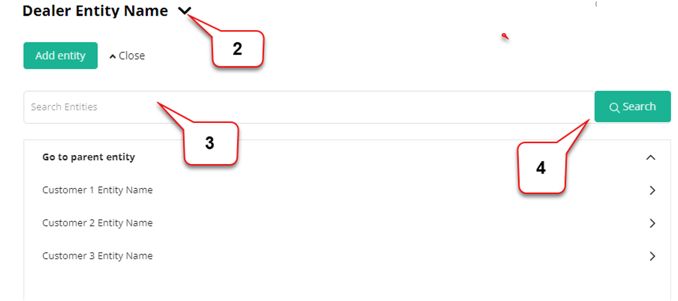
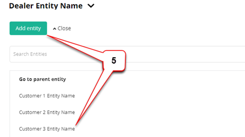
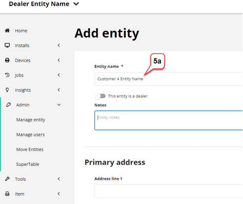
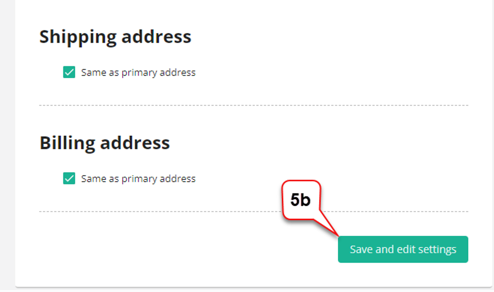
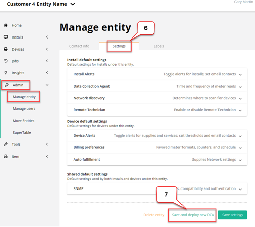
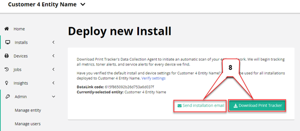
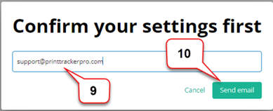
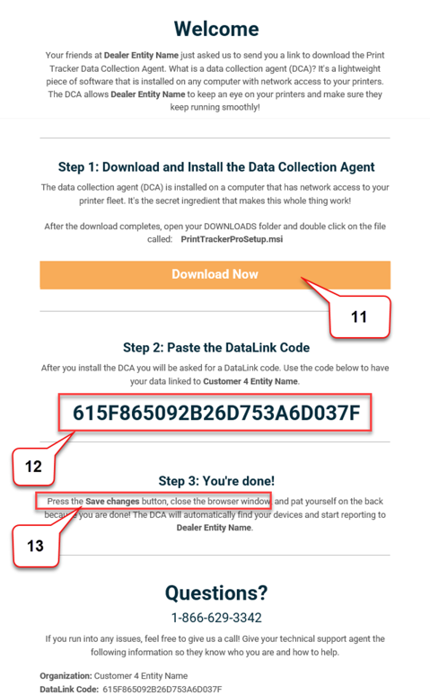

In order to use Print Tracker to collect data from printer devices, you must install a data collection agent (referred to as an "install" in Print Tracker) that has network access to the printer devices. The following step-by-step will help you install and register a data collection agent. Installs must be registered to an [entity](../webadmin/concepts/entities-users-and-installs.md).

1. Log-on to Print Tracker Pro Admin user interface from [https://www.app.printtrackerpro.com/auth/login](https://www.app.printtrackerpro.com/auth/login).
2. Click on the list box drop-down arrow next to your dealer entity name. 
3. Search to see if your customer has an entity record by entering the customer’s name in the ‘Search Entities’ input box.
4. Press the ‘Search’ button (an alternative is to search through the list).

5. If the customer does not yet have an entity, then click on the ‘Add entity’ button and go to step _5a_ OR if the customer entity is in the list, then select it and go to step 6.

       1. Enter the new customer’s ‘Entity name’ and optionally enter notes and address information.
    
       1. Click on the ‘Save and edit settings’ button at the bottom of the ‘Add entity’ screen.
    

6. Review and if necessary, edit entity settings by selecting **Admin > Manage Entity > Settings** This step is optional but recommended prior to deploying Print Tracker installation at customer location since the entity settings will be applied. For more information on the available settings options, see [settings](../webadmin/settings/overview.md)
7. Click on the ‘Save and deploy new DCA’ button.

8. From the **Installs > Deploy new install** screen select either:

       1. ‘Send Installation email’ to send a deployment e-mail to the recipient who is to install the data collection agent.
       2. 'Download Print Tracker’ if you are logged-on the host computer that the data collection agent is to be installed on.
9. If sending an installation e-mail enter an e-mail address.
10. Click on the ‘Send email’ button.

11. The user opens the installation e-mail and clicks on the ‘Download Here’ button.
12. When the installation process prompts the user for a Data Link Code copy and paste the one in the e-mail.
13. The user should press the ‘Save Changes’ button to activate the installation.

