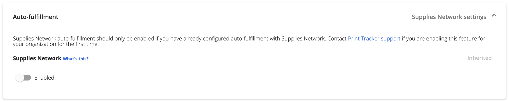

Print Tracker currently supports integrating with Supplies Network for automatic supply auto-fulfillment. All auto-fulfillment configuration is managed through Supplies Network, Print Tracker only allows you to either enable or disable the integration. When enabled, meter reads are sent to Supplies Network daily for predictive analysis. 

## Who are you?
### Dealer
Dealers that are setting up a Supplies Network integration for the first time should reach out to Supplies Network and Print Tracker to setup the integration for their dealership.

### Anyone else
Assuming that a Supplies Network integration has already been setup by your dealer, you can enable this integration at any entity or even for specific devices.

## Enabling Auto-fulfillment

### For an Entity
If you want to enable Supplies Network for an entity and all of its children, then

1. Navigate to the entity using the entity selector
2. Using the sidebar, click **Admin > Manage entity**
3. Click the **Settings** tab
4. Click **Auto-fulfillment** under the "Device default settings" section
5. Set the **Enabled** toggle to the "on" position.

### For a Device
If you want to enable or explicitly disable Supplies Network for a specific device, then

1. Using the sidebar, click **Device > View Devices** to view your full device list
2. Find the device you want to configure and click on it
3. Click on the **Settings** tab
4. Click **Auto-fulfillment** under the "Device settings" section
5. Set the **Enabled** toggle to either "on" or "off".
