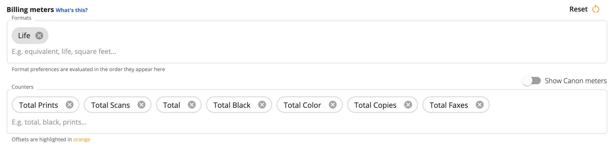
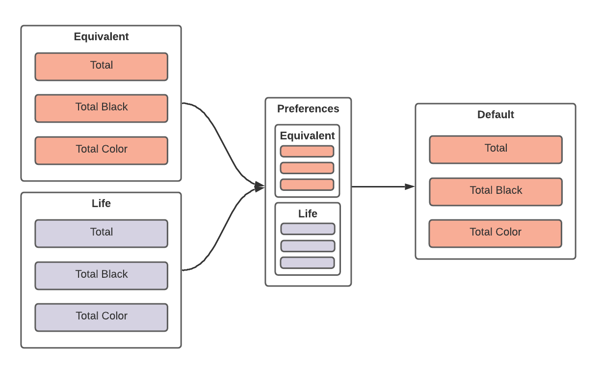
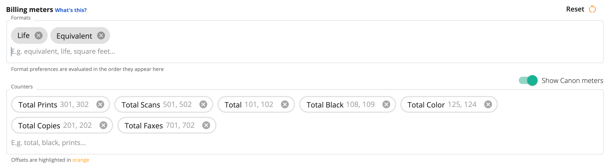
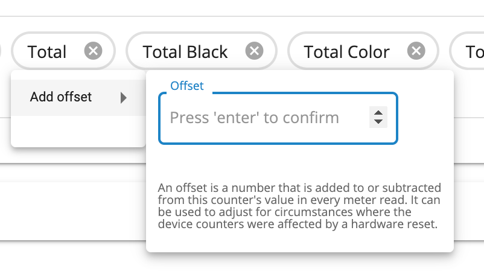
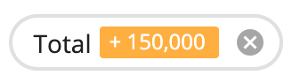

Billing meters allow you to set default formats and counters. These defaults are displayed on the Device Overview tab, and in all the default custom reports. Because many devices measure page counts using different measurement formats and counters, Print Tracker is designed to allow you to customize on a per-device basis which of those measurement formats and counters you care about. Examples of measurement formats may include:

|Formats|
|--|
|Equivalent|
|Life|
|Linear feet|
|Square feet|
|Linear meters|
|Square meters|

Some examples of counters are

|Counters|
|--|
|Total|
|Total Black|
|Total Color|

In most cases, the same counter will appear in multiple formats, which is another way of saying that for a given device, the total counter can be represented in equivalent page counts as well as engine page counts (life). The page count that you choose to make your default depends on how your device's contract is structured.

* Equivalent
    * Total
    * Total Black
* Life
    * Total
    * Total Black

## Configuring Billing Meters
You can easily pick which formats and counters you care about for a device.

1. Using the sidebar, click **Devices > View Devices**
2. Click on a device from the device list
3. Click the **Settings** tab
4. Click on the **Billing Preferences** accordion

### Billing Meters Editor
The billing meters editor allows you to pick the format and counter preferences for a device. A device may only have one format preference. If you configure multiple format preferences, the preference that occurs first and is reported by the device is set as the only default format going forward; all other formats are removed from the list.

These preferences act as a "projection" of sorts. They allow you to configure what formats and counters you care about and everything else is filtered out.

#### Canon Meters
The billing meter editor works for all devices regardless of make or model, however, for some people, the Canon numbering system may be more comfortable to work with. Most of the common Canon numbered meters have been mapped to human-readable names that can be consistently used for all devices regardless of make or model. You can enable showing the Canon numbered meters by toggling **Show Canon meters** on the right-hand side of the billing meter editor.

!!!note
    Toggling "Show Canon meters" is purely aesthetic. All Canon devices will have their meters correctly mapped regardless of whether this toggle is on or off.

In the previous screenshot, notice how the counters now contain both the name (Total) and the Canon numbered meters in the same order as your format preferences. In this example, our billing preferences prioritize the "Life" format ahead of the "Equivalent" format. This prioritization is also reflected in the order of the Canon numbered meters, the Canon 101 is the Total counter measured in the "Life" format, the Canon 102 is the Total counter measured in the "Equivalent" format.

#### Meter Offsets
In some situations such as when a device's motherboard has been replaced, you may need to offset a counter value by a specific amount since the printers internal counters have been reset. You can do this by clicking on the counter that you want to offset and entering a positive or negative value.

{: style="width:400px"}

After hitting **Enter**, the offset will be applied to only the counter you selected. This offset will be reflected in all the default custom reports, the device overview page, and in your ERP if you're using a data-processor that supports offset meters (such as E-Automate).

{: style="width:200px"}

### Billing Meters and Settings Inheritance
Billing meters are unique from other settings because they can have a serious impact on the accuracy of your reporting and billing. While billing meter preferences can be configured at the entity-level, as soon as a device reports its first meter, the billing preferences used will be locked in for the device and any changes to the billing preferences in your hierarchy will no longer affect the billing preferences used for the device. This prevents an unsuspecting user from changing billing preferences and impacting the meters reported for your entire fleet.
