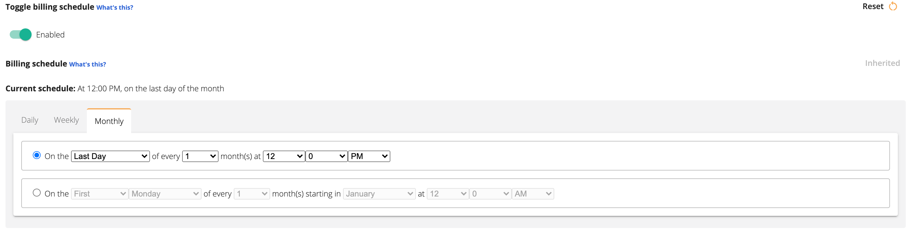

# Billing Schedule
A billing schedule in Print Tracker should reflect the billing schedule of the device in the real-world. If you (as the dealer) bill your end-customer quarterly for a device, you can configure that same billing schedule in Print Tracker. Configuring the billing schedule in Print Tracker groups meter reads together that belong to a specific billing period. This allows reports such as the [Billing Period](../reporting-and-analysis/custom-reports.md#billing-period) report to show only devices and meter reads whose billing periods end on a specified date.

If you do not use an ERP to bill your customers and use a standard meter export from Print Tracker instead, the billing schedule and the Billing Period report are especially useful because they can be configured to send you a report each day with all the devices whose individual billing periods end on that day, along with the counter volumes that occurred during each individual device's billing period.

## Configuring a Billing Schedule
Billing schedules can be configured in bulk on a per-entity basis. The billing schedule you set at the entity-level will cascade down to all child entities and devices (unless explicitly configured otherwise). It's usually more common to configure a billing schedule per-device based on when the device was put under contract.

### Entity-level Billing Schedule
The billing schedule for an entire entity hierarchy can be configured by

1. Under the sidebar, click **Admin > Manage entity**
2. Click the **Settings** tab
3. Click the **Billing preferences** accordion
4. Under Billing schedule, switch the **Enabled** toggle to the "on" position
5. A schedule editor will appear, you can configure any schedule you'd like and then click **Save** at the bottom of the page

### Device-level Billing Schedule _(coming soon)_
This feature is currently [in-progress](https://sharing.clickup.com/t/h/1bzvgn9/2DUBHDNRW5G9G8X).
