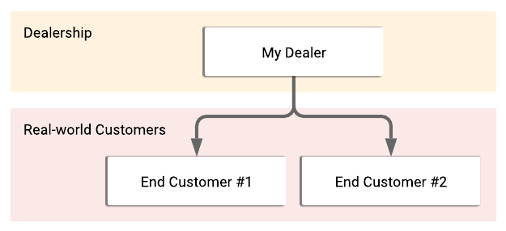
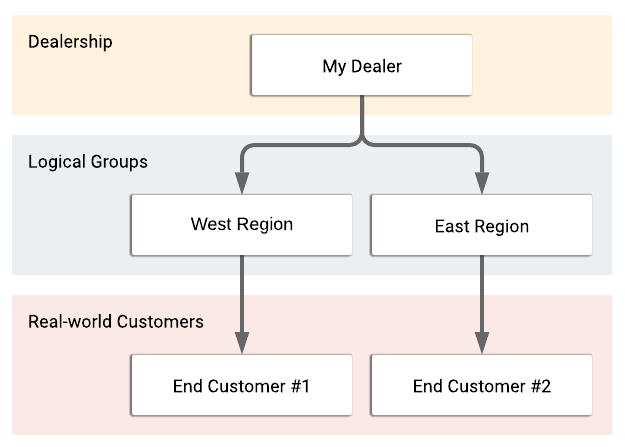
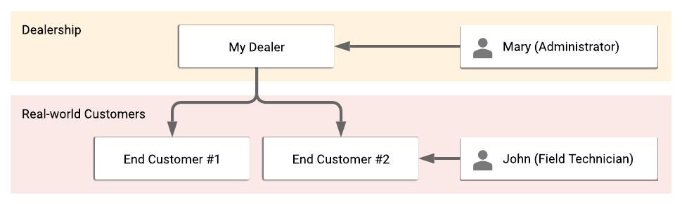
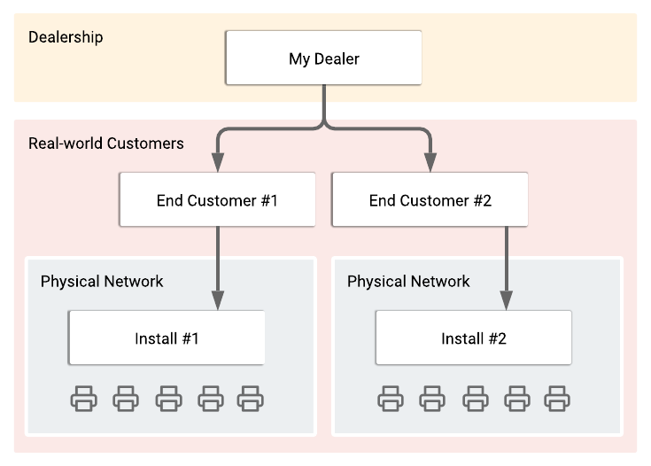

## Entity
An entity is the basic organizational unit within Print Tracker and is synonymous with a customer. All other aspects of the Print Tracker architecture including meter readings, users, installs and jobs are associated with entities and the relationships between entities. An entity is the first thing you'll set up in Print Tracker, so it's important to understand how they work, and how to configure them to best reflect your business model. 

### Hierarchy
Entities can be structured similar to a family tree with both parent entities and child entities. This allows you to organize your entities in Print Tracker without any restrictions. 

Some people may choose to use entity hierarchy to provide logic groupings of entities. In the following example, we have our dealership (named "My Dealer") and two end customers. Instead of organizing our end customers directly under our dealership like we did in the previous example, we've chosen to organize them into two regions, a west and an east region. In this example we're organizing our hierarchy with location-based logical groups. You could come up with many other logical groupings that may make more sense for your business model, for example, you could group entities by sales rep, or by logo color!

## User
A user is a person that has been granted specific roles and permissions to operate within an entity and any of that entity's children. A user belongs to a single entity but has access to the child-hierarchy of the entity to which the user belongs. Users can be anyone from the administrator that setup Print Tracker in the first place, to the field technician responsible for setting up installs (DCAs) and on-boarding new customers.

In the following example, Mary is an administrator at the dealership level, this means she not only has access to the "My Dealer" entity, but also all of the entities below the dealership (in this case "End Customer #1" and "End Customer #2"). John on the other hand is a field technician at "End Customer #2", he does not have permission to see "End Customer #1 or "My Dealer".

## Install
An install, also known in the industry as a data collection agent (DCA), is an individual installation of data collection software installed on a computer within a customer's network. Our data collection agent software is called Print Tracker Pro™. Installs are registered to entities and report data for those entities. An entity usually has one install, but in some cases it may have multiple installs on multiple different machines at the customer location (e.g. for redundancy).

An install is responsible for discovering printing devices on the local network, collecting meter and supply data, and uploading that data to Print Tracker so that it can be viewed and exported by you.

