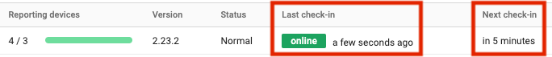

Users communicate with installs through using jobs. A job is a collection of related tasks that instruct an install how to perform some set of actions such as a device scan, or a meter upload. Jobs are created based on actions a user takes in the web-admin and those jobs are then retrieved by the destination install. Some jobs are sent to multiple installs simultaneously, other jobs are run by the install automatically on a schedule determined by your settings.

## Jobs
### Scan devices
A scan devices job scans any network segments looking for devices that meet the [qualifications described here](devices.md#discovery). This job is sent to every install that is registered at the currently selected entity, this means that you must navigate to the entity where you want to scan for devices before running a scan devices job.

### Upload meter reads
An upload meter reads job collects and uploads meter reads from every known device. By default, this job runs once a day. This job is sent to every install that is registered at the currently selected entity, this means that you must navigate to the entity where you want to upload meter reads before running a upload meter reads job.

### Process events
A process events job analyzes meter reads that are stored locally on the install to see if any supply or service alerts should be fired. By default this job runs once an hour following the hourly meter collection.

### Update install settings
Whenever an install setting is saved, a job is immediately sent to the install which retrieves the updated settings.

### Update device settings
Whenever a device setting is saved, a job is immediately sent to all installs that are tracking that device. The job is used by the install to retrieve the updated settings for the device.

### Restart
A restart job restarts the install. You may optionally send a "standalone" restart job which runs immediately. Normally, jobs are queued up rather than running concurrently, a "standalone" restart preempts this queue, restarting the DCA regardless of whatever it's currently doing. We highly discourage sending "standalone" restart jobs except in scenarios where the install is online but jobs are continuously sitting in the "received" status.

## Service Mode vs Normal Mode
An install can be in one of two modes which determine how quickly a job is received by an install.

!!!note
    Service mode does not need to be enabled to use Remote Technician. Remote Technician uses its own streaming connection.

* **Service Mode** maintains a bi-directional stream between the install and the web-admin allowing you to send jobs from the web-admin and the install will pick them up nearly instantaneously. Service mode is useful when you're doing iterative configuration (change a setting, test something, change another setting, test something else, etc) because it allows you to not have to wait for several minutes everytime you send a job. For information about the details of this bi-directional stream and the security considerations Print Tracker has put in place, check out [the whitepaper](../../dca/whitepaper.md#security).

* **Normal Mode** disables the bi-directional stream in favor of a periodical polling approach. The install usually polls every 5 minutes. When normal mode is enabled, you may find that jobs sit in the 'sent' status for several minutes at a time. In normal mode, the install reports the next time it will poll, in addition to the previous time it polled. You can view this information on the **Installs > View installs** page.
  

You can enable **Service Mode** by 

1. Navigating to the **Installs > View installs** page
2. Click on the install row that you'd like to configure
3. Click the **Settings** tab
4. Expand the **Data collection agent** accordion
5. Enable **Real-time connection**

