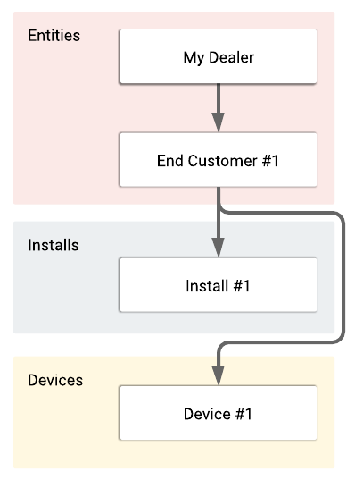

# Settings
Settings determine the behavior of everything inside of Print Tracker, including the time of day that meter reads should be collected, the IP addresses that should be scanned, even the timeout and retry values to apply to specific devices during data collection. All settings have defaults that will work in the majority of cases, but we understand that there are always edge-cases in the printer world and we have provided you with as much flexibility as possible. Understanding the settings available to you, and what they do will unlock the power of Print Tracker for your company.

Before we get into the specifics of each and every setting, it's important to understand how settings work, how they're inherited, and how changes propagate through your hierarchy.

## Inheritance
Settings can be configured on entities, installs, and devices. Some settings that are applicable to the install may not be applicable to the device such as which IP addresses should be scanned. Settings are inherited from top to bottom through the entity hierarchy, to both installs and devices. While the hierarchy architecture goes entities > installs > devices, settings inheritance goes from entities to installs and entities to devices, but not entities through installs, to devices. This is a critical distinction to make, in other words, settings changes on an install are not inherited by the devices, whereas settings changed at entities are inherited by both installs and devices. In the following example diagram, the arrows denote the settings inheritance path.

Settings inheritance allows you to be explicit about what settings should apply where, while optionally being broad and sweeping in their effects. We mentioned that settings are inherited top to bottom, if I were to change the supply alert email address setting at "My Dealer" in the previous example, all the hierarchical children of "My Dealer" (including "End Customer #1", "Install #1", and "Device #1") would inherit that change. If on the other hand I change the supply alert email address setting at "Device #1", then only "Device #1" will have the changed setting.
