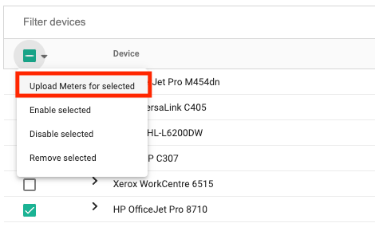
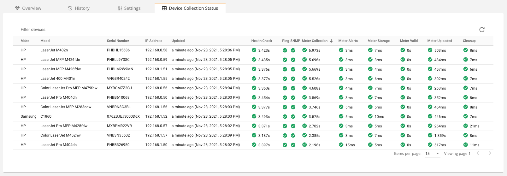
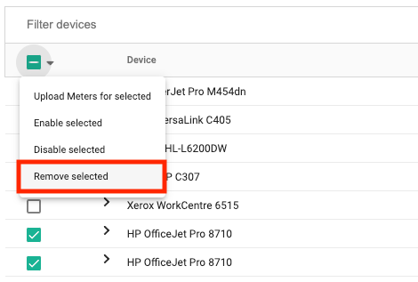
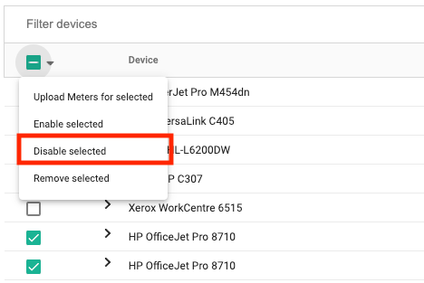
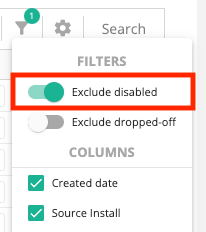

## Discovery and Management
Fleet management starts with discovering devices. Devices are discoverable if they are located on a network accessible to your [install](../concepts/entities-users-and-installs.md#install) (on the same network, VPN access to the network, etc). For more information on what is required in order to discover a device, see [devices](../concepts/devices.md#networked-devices).

### Discovering Devices
To scan your network for devices:

1. Using the sidebar, click **Devices > View Devices**.
2. In the top, left corner click **Scan for devices**.
3. Enter an IP address of a known device. You may also provide:
      1. Wildcard such as 10.0.0.* which would scan IP addresses 10.0.0.0-10.0.0.255.
      2. Range such as 10.0.0.1-10.0.0.10 which would scan the first 10 IP addresses of the 10.0.0.* subnet.
      3. CIDR notation such as 10.0.0.0/24 which would scan IP addresses 10.0.0.0-10.0.0.255.
4. Optionally exclude specific IP addresses that should not be scanned (this is not required, however for some sensitive networks you may prefer to exclude servers or networking hardware).
5. Optionally click **Upload meters from devices** if you would like to immediately upload meters for devices that you have discovered (note that meter uploads can take a long time, you may want to do this later after you've discovered all the devices you're looking for).
6. Click **Add devices**.
7. A list will open that asks which install you want to use to run the scan. In most cases, you can just stick with the default selected install (if there is only one install at the entity).

### Tracking Status
If a device's tracking status is enabled, the device is considered a "managed" device and Print Tracker will charge you for it. If the tracking status is disabled, the device is considered a "non-managed" device. You can set the tracking status in several, different ways, however in the next section, we'll talk about un-managing newly discovered devices.

### Viewing New Devices
The "View devices" page lets you see all devices that have been discovered by your install, however in some cases it's helpful only to see the devices that have recently been discovered, for example you may want to keep an eye on newly discovered devices so that you can un-manage the ones that you don't care about tracking. The "New devices" page allows you to view recently discovered devices and optionally un-manage them before Print Tracker begins to bill you for them. This list contains devices that have been discovered within the last 30 days.

!!! warning
      You will be billed for devices if they are not marked as non-managed within the first seven days since their discovery.

1. Using the sidebar, click **Devices > New devices**.
2. If you would like to set a device as non-managed:
      1. Find the column named **Tracking Status**. By default, all devices are enabled.
      2. Click on the blue hyperlink **Enabled**.
      3. Select **Disable**. If the device's **First billing date** is in the past, you will be billed for the current billing period, but not subsequent billing periods. If the device's **First billing date** is in the future (and highlighted orange) then you will not be billed for this device at all.

## Meter Collection
After a device has been discovered, you can collect and upload meters from it.

### Uploading Meters
By default, managed devices will upload meters every 24 hours within a configurable window. You can optionally request a meter upload for a single device or for all your devices at a single customer on-demand.

#### Single Device
To upload meters for a single device:

1. Using the sidebar, click **Devices > View devices**.
2. Find the device that you want to upload meters in the list of devices.
3. Click the checkbox in the left-most column of the table.
4. In the table header, click the small down-arrow to the right of the header checkbox.
5. Select **Upload meters for selected**.

#### All Devices

!!! info
      Upload meters for all devices does not take hierarchy into account. For example, you cannot click **Upload meters** at your dealer level and expect meters to be uploaded from all of your customers. Meters will only be uploaded from the installs that are at your selected entity.

To upload meters for all devices at a single customer:

1. Using the sidebar, click **Devices > View devices**.
2. Click the **Upload meters** button.

#### Changing the Upload Window
You can customize what time of day meters should be collected and uploaded using six-hour increments. You can customize this setting on a dealer, entity, or install level. In this example, we'll show you how to set this setting at the entity level (for all installs at a single entity).

!!! info
      This time of day only specifies a preference, if the device is offline or otherwise unavailable during the time of day that you've configured, it will upload a meter as soon as it becomes available again.

1. Using the sidebar, click **Admin > Manage entity**.
2. Click the **Settings** tab.
3. Expand the **Data Collection Agent** section.
4. Click **Upload daily meter read** and specify which time of the day you want meters uploaded.

### Device Collection Status
Every install reports the status of its meter collections for each device. These statuses can help you identify why a device may not be reporting. The following grid illustrates a set of steps followed when uploading meters and the outcome of each step.

To open the device collection status grid:

1. Using the sidebar, click **Installs > View installs**.
2. Find the install that you want to view collection statuses for and click on it.
3. Click on the **Device Collection Status** tab.

The table contains device information as well as several key processes that occur chronologically from left to right for each device:

* **Health Check** - A health check is performed on the device, this health check determines if the device is accessible on the network and if SNMP is enabled.
* **Ping** - During the health check, the device is pinged to make sure it's accessible on the network. If this check fails, the device has most likely changed IP addresses or is turned off.
* **SNMP** - During the health check, the install attempts to connect to the device over SNMP to make sure that SNMP is enabled and the SNMP settings are valid. If this check fails and the previous ping check succeeded, the device has either changed IP addresses, the current SNMP settings are invalid, or the SNMP timeout and retry values are insufficient.
* **Meter Collection** - A meter is collected from the device which includes both page counts and supply information. If this step fails, and the previous steps have succeeded, you will most likely need to contact Print Tracker support so that the data collection logic can be verified for this model.
* **Meter Alerts** - The meter is scanned for any alerts, this includes supply alerts, replacement alerts, PCR alerts, maintenance alerts and more.
* **Meter Storage** - The meter is saved to a local database for future analysis.
* **Meter Valid** - Ensures that the meter does not contain any counter drops and that the meter is not empty.
* **Meter Uploaded** - Ensures that the meter is uploaded successfully to the cloud where it is viewable by you.
* **Cleanup** - Old historical meter reads are removed from the database in order to optimize performance.

## Cleanup
In some cases you may need to remove devices that have been de-commissioned and are no longer on the network, or you may need to mark a device as non-managed because it is no longer under contract. Whether you should remove or un-manage a device depends on your use-case. Devices that are removed could potentially be re-discovered. You should only remove a device if it no longer exists on the network. If a device still exists on the network, but you want to hide the device, you should un-manage the device rather than removing it.

### Removing a Device
Removing a device deletes a device and all of its history from Print Tracker. This operation is irreversible.

1. Using the sidebar, click **Devices > View devices**.
2. Find the device or devices that you want to remove in the list of devices.
3. Click the checkbox in the left-most column of the table.
4. In the table header, click the small down-arrow to the right of the header checkbox.
5. Select **Remove selected**.

### Disabling a Device
Disabling a device prevents daily meters from being uploaded and prevents you from being charged for the device.

1. Using the sidebar, click **Devices > View devices**.
2. Find the device or devices that you want to remove in the list of devices.
3. Click the checkbox in the left-most column of the table.
4. In the table header, click the small down-arrow to the right of the header checkbox.
5. Select **Disable selected**.

### Hiding Disabled Devices
Devices that are non-managed can still be viewed on the "View devices" page. You can hide these devices by:

1. Using the sidebar, click **Devices > View devices**.
2. Click on the **filter icon** on the top-right side of the devices table.
3. Click **Exclude disabled** to hide the non-managed devices.

