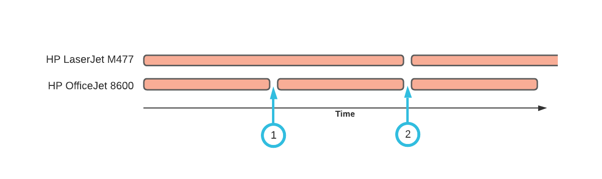
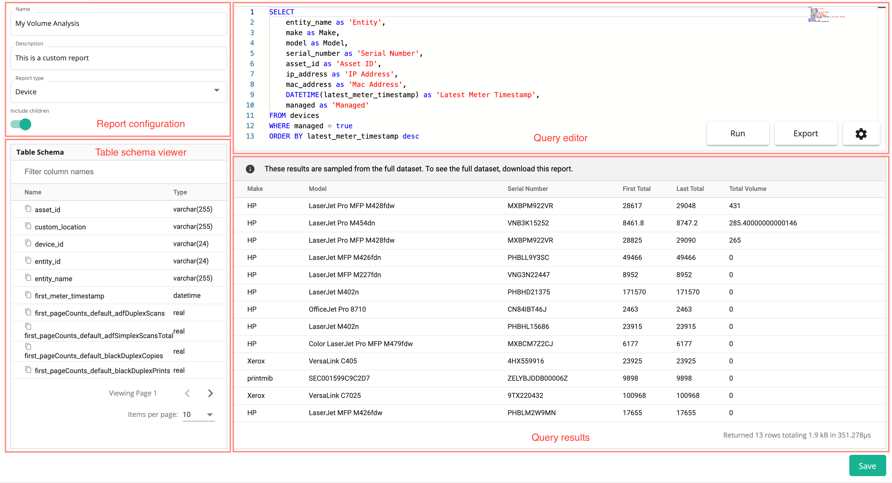
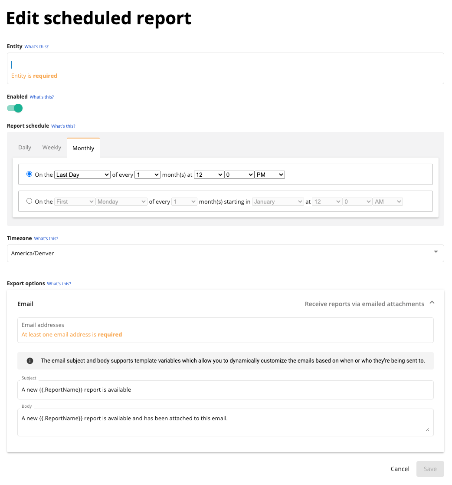

Custom reports allow you to design a build exportable reports using SQL queries. Print Tracker provides a set of pre-build SQL queries that should cover most reporting requirements. In the situations where you need more advanced flexibility, you can harness the power of SQL to create exactly what you're looking for.

A report can be one of several report types. The report type determines the type of data that is available for use in the report. We'll go into each of these report types in detail shortly.

* [Device](#device) - Returns information about devices such as the make, model, serial number, IP address, mac address, asset ID, location, notes, entity name and latest meter read timestamp. This report type is useful for getting information about your fleet of devices.
* [Current Meter](#current-meter) - Returns the previously mentioned device information along with columns for the most recent meter read of the device. To learn more about the schema design for meter reads, see [Meter Read Table Schema](#meter-read-table-schema).
* [Volume Analysis](#volume-analysis) - Returns the previously mentioned device information along with columns for the first meter and last meter reads in a specified date range. This report is useful for comparing the volume changes in different meters over time.
* [Billing Period](#billing-period) - Returns the same information as the Volume Analysis report but allows the user to specify a single billing date. All devices that have been configured to bill on the specified date will be returned in the report.
* [Device History](device-history.md) - This report type is only accessible on a per-device basis. We will not cover this report type in this section, for more details and how to use it, see [Viewing Device History](device-history.md#viewing-device-history).

## Report Types
### Device
This report type can be used to return basic information about your fleet of devices, for example the following query returns the make, model and serial number for each device.

```sql
SELECT make, model, serial_number
FROM devices
```

|make    |model              |serial_number  |
|--------|-------------------|---------------|
|HP      |LaserJet Pro M454dn|VNB3K15252     |
|Xerox   |VersaLink C405     |4HX559916      |
|Brother |HL-L6200DW         |U64180D9N509865|
|Ricoh   |MP C307            |C508P103178    |


You can perform more complicated aggregations to get insights into your fleet. For example, you can figure out the number of device by model sorted by most popular model to least popular model.
```sql
SELECT make, model, count() as count
FROM devices
GROUP BY model
ORDER BY count DESC
```

|make |model              |count|
|-----|-------------------|-----|
|HP   |OfficeJet Pro 8710 |6    |
|Epson|WF-4740            |4    |
|HP   |Officejet 5740     |3    |
|HP   |LaserJet Pro M404dn|3    |
|HP   |LaserJet M402n     |3    |

[comment]: <> (### Install)

[comment]: <> (This report type can be used to return basic information about your fleet of installs, for example, the following query returns the hostname, operating system, and last check in date for each install.)

### Current Meter
In a normal scenario, an install will collect a meter read from a device every day. This report type allows you to view the most recent meter read collected for this device. There are many available column names, to learn more about the schema design for meter reads, see [Meter Read Table Schema](#meter-read-table-schema) or use the [Table Schema viewer](./table-schema-viewer.md).

In this example, we'll use this report type to view the most recent values for the total, total black and total color counters.

```sql
SELECT
    make as Make,
    model as Model,
    DATETIME(latest_meter_timestamp) as 'Timestamp',
    pageCounts_default_total as 'Total',
    pageCounts_default_totalBlack as 'Total Black',
    pageCounts_default_totalColor as 'Total Color'
FROM meters
ORDER BY latest_meter_timestamp DESC
```

|Make    |Model              |Timestamp      |Total              |Total Black|Total Color|
|--------|-------------------|---------------|-------------------|-----------|-----------|
|HP      |OfficeJet Pro 8710 |2021-08-10 14:24:35|13076              |8039       |5923       |
|HP      |Officejet 5740     |2021-08-10 14:24:33|7287               |           |           |
|Xerox   |VersaLink C7025    |2021-08-10 14:24:12|101299             |96472      |4827       |
|Epson   |WF-4740            |2021-08-10 14:24:10|50045              |35055      |14990      |
|HP      |LaserJet MFP M426fdn|2021-08-10 08:57:30|49900              |49900      |           |

### Volume Analysis
This report type allows you to compare any meter read value between two dates that you can specify. The first meter read column names are prefixed with `first_` and the last meter read column names are prefixed with `last_`. This report is different than the previously mentioned reports because it allows you to specify a start and end date. The first meter read returned is the meter read closest to, but greater than the start date. The last meter read returned is the meter read closest to but less than the end date. There are many available column names, to learn more about the schema design for meter reads, see [Meter Read Table Schema](#meter-read-table-schema) or use the [Table Schema viewer](./table-schema-viewer.md).

In the following example, we'll start by comparing the total counter between the start and end date, and adding a calculated column indicating the volume.

```sql
SELECT
    make as 'Make',
    model as 'Model',
    serial_number as 'Serial Number',
    first_pageCounts_default_total as 'First Total',
    last_pageCounts_default_total as 'Last Total',
    last_pageCounts_default_total - first_pageCounts_default_total as 'Total Volume'
FROM meters
ORDER BY last_pageCounts_default_total - first_pageCounts_default_total DESC
```

|Make    |Model              |Serial Number  |First Total        |Last Total|Total Volume|
|--------|-------------------|---------------|-------------------|----------|------------|
|Epson   |WF-4740            |X2TY047472     |10787              |50045     |39258       |
|HP      |OfficeJet Pro 8710 |CN7BUBW18F     |2414               |13076     |10662       |
|HP      |LaserJet Pro M404dn|PHBB610068     |128072             |131745    |3673        |
|HP      |LaserJet M402n     |PHBHD21375     |170668             |173089    |2421        |
|HP      |LaserJet MFP M227fdn|VNG3N22447     |8429               |10835     |2406        |

!!!note
    Notice how in the Current Meter report type, we reference the total counter using the column name `pageCounts_default_total` but in the Volume Analysis report type, we referenced the total counter using both the `first_pageCounts_default_total` and `last_pageCounts_default_total` column names. The Volume Analysis report gives us two meter reads between the specified date range and every value in each meter read is prefixed with its respective prefix.

### Billing Period
This report type is almost identical to the Volume Analysis report type. The major difference is that the Billing Period report allows you to specify a billing date rather than a date range. The Volume Analysis report's date range returns device meter reads for the same time period for all devices whereas the Billing Period report returns the first and last meter reads for each device whose billing period ends on the specified billing date. To understand which devices will appear in a Billing Period report, let's assume we have two devices with the following billing periods.

|Device|Billing period|
|--|--|
|HP LaserJet M477|Bi-monthly|
|HP OfficeJet 8600|Monthly|

Let's plot the billing periods over the course of three months. If the selected billing date in the Billing Period report were to be the last day of month one (#1), then only the HP OfficeJet 8600 device would appear on the Billing Period report. This is because it's the only device whose billing period ends on the selected billing date.

If we were set the billing date to be the end of month two (#2) then both the HP LaserJet M477 and the HP OfficeJet 8600 would appear on the Billing Period report. This is because both device's billing periods end on the selected billing date.



The Billing Period report allows you to configure the billing period (or contract date, or billing date, etc) for each device individually, and then view all the devices whose billing periods end on the selected billing date. It is an alternative to the Volume Analysis method of grouping device and meter data together that more closely reflects how device contracts are managed in the real-world.

There are many available column names, to learn more about the schema design for meter reads, see [Meter Read Table Schema](#meter-read-table-schema) or use the [Table Schema viewer](./table-schema-viewer.md).

## Creating a Report
To create a report

1. Navigate to the **Insights > Reports** page using the sidebar.
2. Click **New Report** and give the report a name, for example **"My Volume Analysis"**.
3. Click on the new row in the reports list that was just added. You can customize the name or description of the report in the top-left corner of the "Configuration" tab.
4. Click **Report Type** and select **"Volume Analysis"**. This will populate a default volume analysis query in the query editor.

[comment]: <> (    ![]&#40;../images/new-report-report-type.png&#41;{: style="width:400px"})

5. Click **Run** to output a sample of the pre-built query.
6. Click **Export** to export a CSV file containing the full dataset. Because the CSV export uses the full dataset, it often takes longer then just clicking Run.

### Report Editor
Let's pause for a moment and review the different parts of the custom reports editor starting in the top-left corner.

* **Report configuration** allows you to configure metadata about the report for your own organizational purposes (name and description), as well as how the report itself should behave. You can configure the [report type](#report-types) and whether the report should include children or not. Reports that include children will include data from the current entity and all children entities.
* **Query editor** comes with pre-built queries for each report type. Any [SQLite-compatible statements](https://www.sqlite.org/lang.html) can be used in this editor. You can use the "Run" button to test your query on a small sample of your full dataset, or "Export" your full dataset using the provided query. It gives you full control over things like:
    * Column names
    * Calculated columns
    * Aggregations and sorting
    * Filtering
* **[Table Schema viewer](./table-schema-viewer.md)** allows you to view all the available columns and column types that can be used in your query.
* **Query result** is a table containing a small sample of your full dataset after being processed using your query. It should give you an idea of what the exported data will look like.
* The save button in the button right-hand corner must be clicked everytime you're finished making changes.



## Scheduling a Report
Any report can be automatically emailed on a pre-defined schedule. You can create any number of schedules for a single report. Each schedule can be completely customized for a specific entity and contain custom email subject line and body text. You can even use template variables

1. Assuming you've already selected a report from the list of reports, click the **Schedules** tab.
2. Click **New Schedule**, this opens up a modal with all the options for creating a new scheduled report. Let's break down each option:

    

     * **Entity** refers to the scope of the data that should be included in the report, for example if you're sending the report to yourself and you want the data for your entire dealership, you would search for your entity's name. If you're setting up a scheduled report on behalf of an end-customer and you want to limit the scope of the data in the report to just that end-customer, you would enter the end-customer's entity name.
     * **Enabled** allows you to enable and disable a scheduled report without deleting it entirely. This is useful for temporarily pausing the scheduled reports.
     * **Report schedule** allows you to pick a schedule for how often a report should be sent.
     * **Timezone** defaults to the timezone of your browser and determines which timezone should be used when determining when to send the reports. If you're creating a scheduled report for an end-customer and the end-customer is in a different timezone from you, you may want to specify the end-customers timezone here so that the report schedule reflects when the end-customer will get their report.
     * **Export options** currently only supports email. You can specify any number of email addresses for this scheduled report as well as a custom subject and body for the email. The subject and body support template variables for customizing the scheduled report. Currently, only `ReportName` and `EntityName` are supported.


3. After configuring the scheduled report, make sure to click **Save**.

### Considerations
#### Scheduled Reports and Dates
Different [report types](#report-types) accept different customizations, for example the [Volume Analysis](#volume-analysis) report type allows the user to specify a start and end date and the [Billing Period](#billing-period) report type allows the user to specify a billing date. When a report is scheduled, it's obviously not possible or ideal for the user to specify these dates for each scheduled report that gets sent out. Instead, Print Tracker derives these customizable dates from the configured schedule. Let's look at a few examples:

* Let's assume we've created a volume analysis report that is scheduled for the first day of every month. On February 1st, the volume analysis report will be created with a start date of January 1st and an end date of February 1st. The date range ends on the date of the scheduled report (February 1st) and starts at the previous intervals end-date (January 1st).
* Let's assume we've created a billing period report that is scheduled for every day. On February 1st, the billing period report will be created with a billing date of February 1st. On February 2nd, the billing period report will be created with a billing date of February 2nd, and so on.

#### SQL `WHERE` Clause
SQLite supports using the `WHERE` keyword to perform advanced filtering predicates. Keep in mind that the report editor takes a [sample of the full dataset](#report-editor), this means that the filtering predicates you apply using SQL `WHERE` clauses may not return any results if the smaller sampled dataset does not have any rows that match the `WHERE` predicate. You might also find that because the full dataset is randomly sampled everytime you start working on a new report, the results of your query may differ between query executions.

This problem does not apply to exported reports because they do not take a random sample of the dataset, rather exported reports perform your query on the dataset as a whole. This means that query executions are deterministic and if no rows are returned, there simply isn't a row in your dataset that matches your `WHERE` predicate.

## Meter Read Table Schema
The meter read follows a hierarchical pattern for organizing related page counts and supplies. The hierarchy looks something like this. Some meter reads contain much less data (sometimes only the total counter), and some meter reads contain much more data. You can always refer to the [Table Schema viewer](./table-schema-viewer.md) to view all the available columns. Devices that do not support certain properties will return `nulls` in these columns (or empty values when exported to CSV). 
```yaml
pageCounts:
  default:
    total
    totalBlack
    totalColor
    totalCopies
    totalCopiesBlack
    totalPrints
    totalPrintsBlack
    totalFaxes
    totalScans
  equiv:
    total
    totalBlack
    totalColor
    totalCopies
    totalCopiesBlack
    totalPrints
    totalPrintsBlack
    totalFaxes
    totalScans
  life:
    total
    totalBlack
    totalColor
    totalCopies
    totalCopiesBlack
    totalPrints
    totalPrintsBlack
    totalFaxes
    totalScans
supplies:
  blackToner:
    type
    color
    description
    pctRemaining
  cyanToner:
    type
    color
    description
    pctRemaining
  waste:
    type
    description
    pctRemaining
```

In order to make this hierarchy compatible with standard SQL syntax, we've flattened it -- every hierarchy level is separated with an underscore. We could translate the previous hierarchy to this:

```text
pageCounts_default_total
pageCounts_default_totalBlack
pageCounts_default_totalColor
pageCounts_default_totalCopies
pageCounts_default_totalCopiesBlack
pageCounts_default_totalPrints
pageCounts_default_totalPrintsBlack
pageCounts_default_totalFaxes
pageCounts_default_totalScans
pageCounts_equiv_total
pageCounts_equiv_totalBlack
pageCounts_equiv_totalColor
pageCounts_equiv_totalCopies
pageCounts_equiv_totalCopiesBlack
pageCounts_equiv_totalPrints
pageCounts_equiv_totalPrintsBlack
pageCounts_equiv_totalFaxes
pageCounts_equiv_totalScans
pageCounts_life_total
pageCounts_life_totalBlack
pageCounts_life_totalColor
pageCounts_life_totalCopies
pageCounts_life_totalCopiesBlack
pageCounts_life_totalPrints
pageCounts_life_totalPrintsBlack
pageCounts_life_totalFaxes
pageCounts_life_totalScans
supplies_blackToner_type
supplies_blackToner_color
supplies_blackToner_description
supplies_blackToner_pctRemaining
supplies_cyanToner_type
supplies_cyanToner_color
supplies_cyanToner_description
supplies_cyanToner_pctRemaining
supplies_waste_type
supplies_waste_description
supplies_waste_pctRemaining
```
