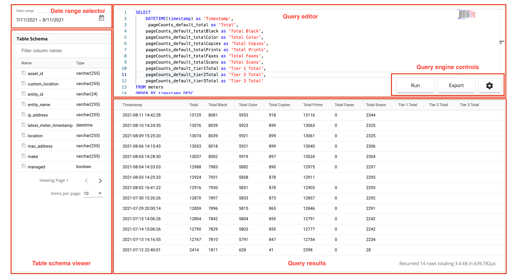

Device historical meter data can be viewed and exported using a built-in query engine. This query engine supports full [SQLite-compatible statements and functions](https://www.sqlite.org/lang.html) and gives you the ultimate flexibility in viewing and exporting all the data your device has to offer. This historical data can be viewed directly in your browser, or exported to CSV.

## Viewing Device History
To view historical meter data for a specific device

1. Using the sidebar, click **Devices > View Devices**
2. Find the device you'd like you view meter history for
3. Click the three dots on the right-hand side of the device row
4. A drop-down menu will open, click **View meter history**
5. A query editor and results viewer will open showing the last 30 days by default
6. To export the data, click **Export** in the query editor

## Device History Query Editor
The device history query editor provides a powerful interface for viewing and exporting the data that you care about for each specific device. By default, the query contains the most common counters (in this case total, total black, total color, total copies, total prints, total faxes, total scans and each of the three-tier color totals).



* **Date range selector** is used to query for meter readings that were reported during a specified time period
* [**Table schema viewer**](./table-schema-viewer.md) shows all the available column names that can be used in your queries
* **Query editor** is used to edit the [SQLite compatible statements](https://www.sqlite.org/lang.html) that determine how your data is returned
* **Query results** shows the result of running your query

## Examples
### Basic Time-series Query
In this example we'll use a simple query to return time-series data sorted by the timestamp of the meter read.

```sql
SELECT
    DATETIME(timestamp) as 'Timestamp',
    pageCounts_default_total as 'Total'
FROM meters
ORDER BY timestamp DESC
```

|Timestamp          |Total|Total Black|Total Color|
|-------------------|-----|-----------|-----------|
|2021-08-11 14:42:28|13129|8081       |5953       |
|2021-08-10 14:24:35|13076|8039       |5923       |
|2021-08-09 15:25:20|13074|8039       |5921       |
|2021-08-06 14:15:43|13053|8018       |5921       |
|2021-08-05 14:28:30|13037|8002       |5919       |

### Volume Over Time Using Window Functions
Using a `LAG` function, we can look at volume over time by counter over time. We'll output the total values of each counter as well as the daily volume of that counter.

```sql
SELECT
    DATE(timestamp) as 'Timestamp',
    pageCounts_default_total as 'Total',
    pageCounts_default_totalBlack as 'Total Black',
    pageCounts_default_totalColor as 'Total Color',
    pageCounts_default_total - LAG(pageCounts_default_total, -1) 
        OVER (ORDER BY timestamp DESC) as 'Total Volume',
    pageCounts_default_totalBlack - LAG(pageCounts_default_totalBlack, -1) 
        OVER (ORDER BY timestamp DESC) as 'Total Black Volume',
    pageCounts_default_totalColor - LAG(pageCounts_default_totalColor, -1) 
        OVER (ORDER BY timestamp DESC) as 'Total Color Volume'
FROM meters
ORDER BY timestamp DESC
```

|Timestamp          |Total|Total Black|Total Color|Total Volume|Total Black Volume|Total Color Volume|
|-------------------|-----|-----------|-----------|------------|------------------|------------------|
|2021-08-11         |13129|8081       |5953       |53          |42                |30                |
|2021-08-10         |13076|8039       |5923       |2           |0                 |2                 |
|2021-08-09         |13074|8039       |5921       |21          |21                |0                 |
|2021-08-06         |13053|8018       |5921       |16          |16                |2                 |
|2021-08-05         |13037|8002       |5919       |49          |19                |37                |
