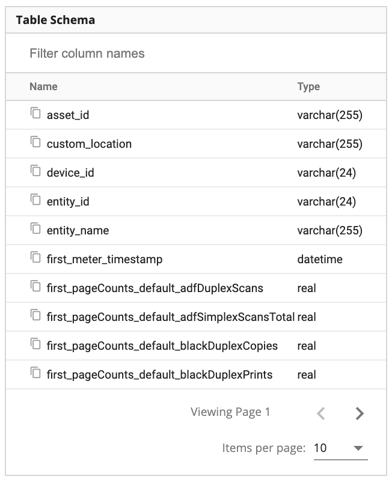

The table schema viewer sits to the left of the query editor and results table. It allows you to see the available column names for the selected report type. The viewer contains two columns:

1. Name - this is the name of the column and is how you reference the column in the query editor. You can click the 'copy' icon to the left of the column name to easily copy the column name and paste it directly into the query editor.
2. Type - this is the SQL data type and may be any one of the [SQLite supported data types](https://www.sqlite.org/datatype3.html).

